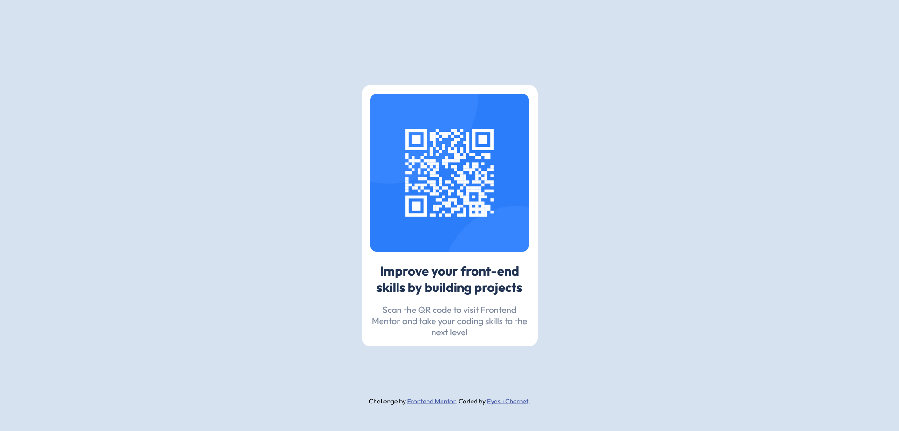

# Frontend Mentor - QR code component solution

This is a solution to the [QR code component challenge on Frontend Mentor](https://www.frontendmentor.io/challenges/qr-code-component-iux_sIO_H). Frontend Mentor challenges help you improve your coding skills by building realistic projects. 

## Table of contents

- [Overview](#overview)
  - [Screenshot](#screenshot)
  - [Links](#links)
- [My process](#my-process)
  - [Built with](#built-with)
  - [What I learned](#what-i-learned)
  - [Useful resources](#useful-resources)


## Overview

### Screenshot



### Links

- Solution URL: [Add solution URL here](https://your-solution-url.com)
- Live Site URL: [Add live site URL here](https://your-live-site-url.com)

## My process

### Built with

- Semantic HTML5 markup
- CSS custom properties
- Position
- Desktop-first approach

### What I learned

I learned how to use rem and implement them in the right way. Before and while doing this challenge I been setting rem on the root element like this: 

```css
  html{
    font-size:62.5%;
  }
```
But after a suggetion from the slack community I have changed the way I implement rem to my project. Now I use calculated values, if the value are repeted I store them in a variable and call them when they are needed and if the values are not repeted I simply use the calculated values. I was using the calc function first but for the sake of clean code I'm just writing the values :

```css
  :root{
    --10px: 0.625rem;
  }

  p{
    margin:var(--10px);
  }
```


### Useful resources

- (https://www.joshwcomeau.com/css/surprising-truth-about-pixels-and-accessibility/) - This article helped me with how to use rem in project, going forward I will be continuing with the guide that is written here.


